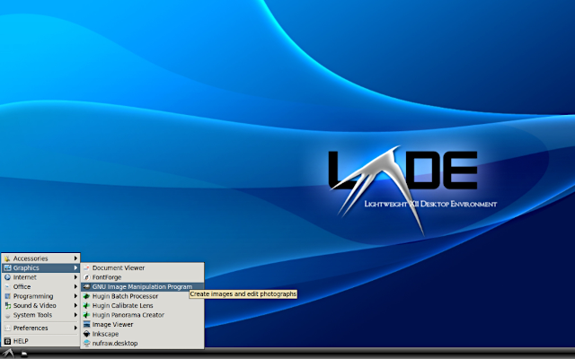
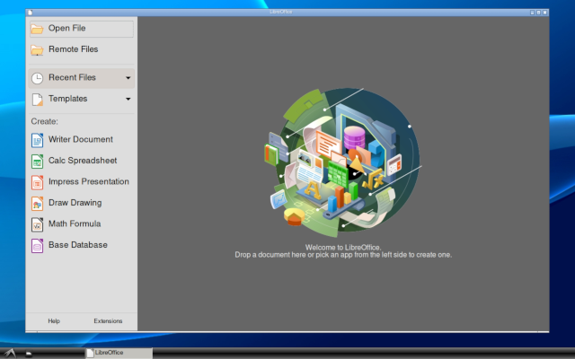

# Alaterm
## LXDE Desktop for Arch Linux ARM on Termux Android
### No root

### DESCRIPTION

Do you have a device that runs Android 8 or later?
Does it have an ARM processor (not Intel, not AMD)?
Would you like to run many advanced Linux programs,
just like on a desktop computer?
Would you like to do this without "rooting" or jailbreaking your device?
If so, then you are in the right place.

I have a 10.1in Samsung Galaxy Tab A 2019 WiFi tablet,
no phone, not rooted, Android 9.
Using the free Termux and VNC Viewer apps (from Google Play Store),
I have been able to install Arch Linux ARM with an excellent LXDE desktop.
Then, I can run GIMP, LibreOffice,
and several other programs that work with touchscreen or mouse and keyboard.
Should also work with a variety of devices that run 32-bit or 64-bit Android,
but there is little benefit for small-screen devices.
Here are some screenshots:

Installation is very complex.
For that purpose, I have written a lengthy BASH script that does it all,
complete with configuration.
When done, it "just works" with a selection of basic utility programs,
and is ready for immediate installation of bigger programs.

The script is written for the benefit of those
who have little or no knowledge of programming.
It is not a fork of the well-known TermuxArch project.

If you decide that you do not like it,
then it can easily be removed without affecting other software.
But once you have it, you will probably like it.

### LIMITATIONS

Your device does not have a lot of computing power.
So, although you can install some heavy-weight programs,
they were designed for desktop computers.
Your device may find that using them is stressful,
especially when used with large files.

Multi-media programs are **not** supported. No audio. No games.
The reason is that multi-media programs require
direct interface to the Android structure.
Besides, your device is built for multi-media using native Android apps.
Adding any kind of Linux capability brings no advantage.

### INSTALLATION (Android only, ARM processor only):

Look at the file INSTALL.md at this site. Simple. No-Brainer.

If installation fails for you, and you have a GitHub account,
be sure to raise an issue.

Installation re-verified on August 28, 2020. Using installer version 2.0.0.
